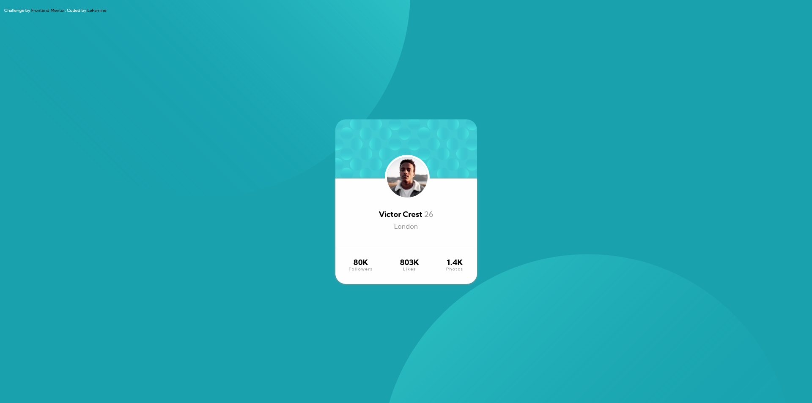

# Frontend Mentor - Profile card component solution

This is a solution to the [Profile card component challenge on Frontend Mentor](https://www.frontendmentor.io/challenges/profile-card-component-cfArpWshJ). Frontend Mentor challenges help you improve your coding skills by building realistic projects. 

## Table of contents

- [Overview](#overview)
  - [The challenge](#the-challenge)
  - [Screenshot](#screenshot)
  - [Links](#links)
- [My process](#my-process)
  - [Built with](#built-with)
  - [Useful resources](#useful-resources)
- [Author](#author)

## Overview

### The challenge

- Build out the project to the designs provided

### Screenshot

### Links

- Solution URL: [LeFamine Solution](https://www.frontendmentor.io/solutions/htmlcss-vanilla-tiNBqiqBT)
- Live Site URL: [LeFamine LiveSite](https://profile-card-frontend-mentor-six.vercel.app/)

## My process

### Built with

- Semantic HTML5 markup
- CSS custom properties
- Flexbox

### Useful resources

- [MDN Web Docs](https://developer.mozilla.org/fr/) - Everything is inside :-)
## Author

- Website - [LeFamine GitHub](https://github.com/LeFamine)
- Frontend Mentor - [@LeFamine](https://www.frontendmentor.io/profile/LeFamine)

